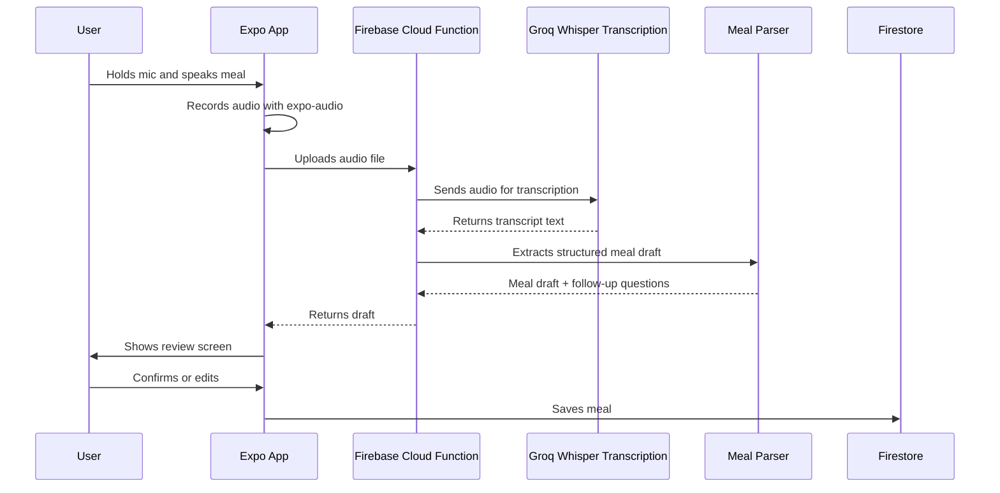
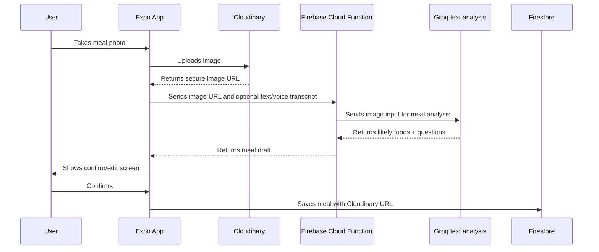
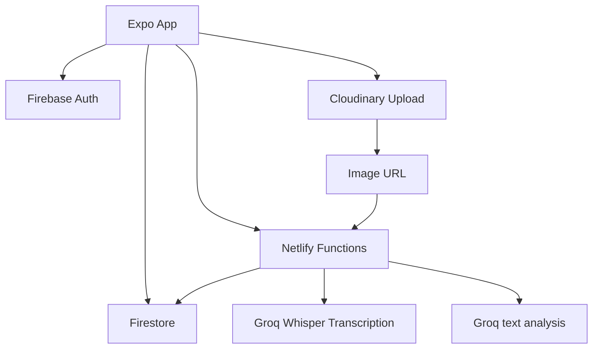

# ChopperHub v2.0 Technical Roadmap

## Purpose

ChopperHub v2.0 should move the product from manual nutrition entry to a guided meal logging experience. The core upgrade is not only AI. It is a simpler daily habit loop:

```text
Open app -> understand today -> log meal quickly -> confirm AI estimate -> see useful insight
```

Version 1 stays safe on `main`. Version 2 work should happen on a separate branch, for example:

```bash
git checkout main
git tag v1.0-safe
git checkout -b codex/version-2-meal-tracking
```

## Product Goals

- Make meal logging practical in under 10 seconds for common cases.
- Replace the current macro-first form with type, voice, and optional camera flows.
- Improve the UI across the app so the product feels like a nutrition assistant, not a spreadsheet.
- Keep AI estimates reviewable. The app should suggest, not silently decide.
- Preserve Version 1 as a safe fallback.
- Keep sensitive keys on the backend.
- Keep the MVP simple enough to ship and test.

## Primary v2 Features

### 1. Guided Add Meal

Current problem: [add-meal.tsx](../src/app/(tabs)/add-meal.tsx) asks users to enter protein, carbs, fat, fibre, sugar, sodium, and water directly.

New direction:

```text
Add Meal

[ Type ] [ Speak ] [ Scan ]

Meal description
Meal type
Portion
AI estimate
Follow-up questions
Confirm and save
```

Required fields:

- Meal description or detected foods
- Meal type: breakfast, lunch, dinner, snack, drink
- Portion: small, regular, large, custom

Optional fields:

- Protein
- Carbs
- Fat
- Fibre
- Sugar
- Sodium
- Notes
- Photo URL
- Voice transcript

Water should be separated from meal logging unless the user explicitly logs a drink.

### 2. Voice Meal Logging

User taps a mic and says something like:

```text
I ate rice, fried plantain, and two pieces of chicken. Regular plate.
```

Flow:



Implementation notes:

- Use `expo-audio` for recording.
- Use Groq Whisper Transcription through the backend.
- Do not put `GROQ_API_KEY` in the Expo app.
- Keep recordings short for cost, speed, and upload reliability.
- Delete temporary audio after processing unless there is a product reason to retain it.

Reference:

- Expo Audio v55: https://docs.expo.dev/versions/v55.0.0/sdk/audio/
- Groq Speech to Text: https://developers.Groq.com/api/docs/guides/speech-to-text

### 3. Camera Meal Scan

Camera should be optional, not the main path. Some users will not want to photograph food in public.

Flow:



Implementation notes:

- Use `expo-camera` or `expo-image-picker` depending on UX.
- Use Cloudinary for image upload and optimization.
- Use Groq API for image understanding, not the Groq Images API for generation.
- Use image + voice/text together when possible. Voice explains what the camera cannot know.

Reference:

- Expo Camera v55: https://docs.expo.dev/versions/v55.0.0/sdk/camera/
- Expo ImagePicker v55: https://docs.expo.dev/versions/v55.0.0/sdk/imagepicker/
- Groq model docs: https://developers.Groq.com/api/docs/guides/images-vision
- Cloudinary uploads: https://cloudinary.com/documentation/upload_images

### 4. AI Meal Drafting

The backend should return structured data, not prose.

Target draft shape:

```ts
type MealDraft = {
  name: string;
  mealType: "breakfast" | "lunch" | "dinner" | "snack" | "drink" | "unknown";
  portion: "small" | "regular" | "large" | "custom" | "unknown";
  ingredients: string[];
  confidence: "low" | "medium" | "high";
  caloriesEstimateMin: number | null;
  caloriesEstimateMax: number | null;
  protein: number;
  carbs: number;
  fat: number;
  fibre: number;
  sugar: number;
  sodium: number;
  followUpQuestions: string[];
  warnings: string[];
};
```

AI rules:

- Prefer ranges over false precision.
- Ask follow-up questions when food, cooking method, or portion is unclear.
- Never claim certainty from an image alone.
- Preserve Nigerian/African meal names naturally.
- Let users edit before saving.

Example response:

```json
{
  "name": "Rice, fried plantain, and chicken",
  "mealType": "lunch",
  "portion": "regular",
  "ingredients": ["rice", "fried plantain", "chicken"],
  "confidence": "medium",
  "caloriesEstimateMin": 650,
  "caloriesEstimateMax": 850,
  "protein": 35,
  "carbs": 95,
  "fat": 22,
  "fibre": 5,
  "sugar": 12,
  "sodium": 600,
  "followUpQuestions": ["Was there stew or sauce?", "Was the chicken fried or grilled?"],
  "warnings": ["Nutrition values are estimates."]
}
```

## UI Upgrade Plan

### Design Direction

The app should feel calm, fast, and focused. Avoid long stacks of heavy cards and raw data tables. Prioritize the daily loop.

Global UI upgrades:

- Create reusable primitives: `Screen`, `Card`, `PrimaryButton`, `IconButton`, `Chip`, `SegmentedControl`, `StatTile`, `EmptyState`.
- Reduce one-off styles inside screens.
- Use consistent spacing: 8, 12, 16, 20, 24, 32.
- Use icons for actions: mic, camera, edit, save, delete, share, back.
- Use fewer borders and clearer hierarchy.
- Use compact cards for repeated meals only.
- Keep screen text short.
- Make loading, error, empty, and permission states polished.

### Home

Goal: show today and make logging obvious.

Proposed structure:

```text
Hi, Arnold

Today
Meals logged
Calories estimate
Protein / carbs / fat snapshot

[ Log Meal ]

Recent Meals
```

### Add Meal

Goal: fastest path to logging.

Proposed structure:

```text
Add Meal

[ Type ] [ Speak ] [ Scan ]

What did you eat?
[ text input or voice transcript ]

Meal Type
[ Breakfast ] [ Lunch ] [ Dinner ] [ Snack ] [ Drink ]

Portion
[ Small ] [ Regular ] [ Large ] [ Custom ]

AI Estimate
[ foods, calories range, confidence ]

[ Save Meal ]
[ Edit Nutrition ]
```

### Tracker

Goal: answer "How am I doing today?"

Proposed structure:

```text
Nutrition analysis
Short plain-language insight

Today
Calories estimate
Meals
Protein
Carbs
Fat

[ View Details ]
```

Hide fibre, sugar, sodium, water behind details.

### Meals History

Goal: scan quickly.

Proposed structure:

```text
Today
Lunch · 1:20 PM
Rice, plantain, chicken
Regular portion · 650-850 cal
```

Tap a meal to view details.

### Profile

Goal: settings-like organization.

Sections:

- Account
- Health preferences
- Notifications
- Subscription
- Data and privacy
- Danger zone

## Technical Architecture



### Recommended Services

- Expo SDK 55 for the mobile app.
- Firebase Auth for users.
- Firestore for meals, profiles, subscription state, and logs.
- Netlify Functions for Groq calls and Cloudinary signing.
- Cloudinary for meal image storage and delivery.
- Groq for transcription, image understanding, and meal parsing.

## Data Model Changes

Existing meal fields should remain compatible:

- `name`
- `quantity`
- `protein`
- `carbs`
- `fat`
- `fibre`
- `sugar`
- `sodium`
- `water`
- `created_at`

Recommended v2 additions:

```sql
meal_type text
portion_label text
portion_quantity numeric
portion_unit text
calories_min numeric
calories_max numeric
confidence text
ingredients jsonb
follow_up_answers jsonb
source text
image_url text
voice_transcript text
ai_raw_response jsonb
user_confirmed boolean default false
```

Suggested `source` values:

- `manual`
- `typed_ai`
- `voice_ai`
- `photo_ai`
- `photo_voice_ai`

## Backend Functions

### `transcribe-meal`

Input:

- audio file
- user id from auth context

Output:

```json
{
  "transcript": "I ate rice, fried plantain, and two pieces of chicken."
}
```

Responsibilities:

- Validate user.
- Validate file size/type.
- Send audio to Groq transcription.
- Return transcript.
- Avoid storing audio unless explicitly needed.

### `analyze-meal`

Input:

```json
{
  "description": "rice, fried plantain, chicken",
  "imageUrl": "https://...",
  "mealType": "lunch",
  "portion": "regular"
}
```

Output:

- `MealDraft`

Responsibilities:

- Send text/image to Groq API.
- Enforce structured output.
- Return draft and follow-up questions.
- Avoid saving until user confirms.

### `sign-cloudinary-upload`

Production-only recommended.

Responsibilities:

- Validate user.
- Generate signed upload parameters.
- Limit folder to something like `chopperhub/meals/{user_id}`.
- Return short-lived signature.

## Cloudinary Plan

Development:

- Use an unsigned upload preset if speed matters.
- Restrict folder, file size, file type, and transformations.
- Treat preset name as sensitive.

Production:

- Use signed uploads through backend.
- Store only optimized image URLs in Firestore.
- Consider deleting images if a user deletes the associated meal.

Recommended transformations:

- Limit width to 1024px before AI analysis.
- Convert to efficient format for delivery.
- Avoid uploading original huge camera files when possible.

## Groq Plan

Required backend secret:

```text
GROQ_API_KEY
```

Recommended capabilities:

- Audio transcription for voice meal logging.
- Responses API for text/image meal analysis.
- Structured outputs for reliable JSON.

Do not expose the Groq key in:

- Expo public env vars
- app config `extra`
- frontend code
- committed files

## App Size And Performance Plan

Existing compression flags in `app.json`:

- `enableBundleCompression`
- `enableMinifyInReleaseBuilds`
- `enableShrinkResourcesInReleaseBuilds`
- `enablePngCrunchInReleaseBuilds`
- `networkInspector: false`

Additional v2 steps:

- Keep camera/audio libraries limited to required Expo packages.
- Avoid adding large UI kits.
- Compress static assets.
- Resize meal photos before upload when feasible.
- Use Cloudinary transformations instead of storing multiple image sizes.
- Lazy-load camera/voice screens if possible.
- Keep debug logs out of release paths.
- Run release builds before judging APK/AAB size.

Verification commands:

```bash
npm run lint
npx tsc --noEmit
npx expo-doctor
eas build --profile preview --platform android
```

If `expo-doctor` or EAS commands need network access, run them in the normal development terminal.

## Security And Privacy

Must-have:

- API keys only on backend.
- Auth required for meal analysis functions.
- Validate image/audio file size.
- Validate MIME type.
- Rate-limit AI endpoints per user.
- Store AI estimates as estimates, not medical facts.
- Add clear user-facing language: "Nutrition values are estimates."
- Let users delete meals and associated media.

Consider:

- Do not store voice recordings by default.
- Store transcripts only if they help the user edit or audit the meal.
- Store original AI response for debugging during beta, but consider reducing later.
- Avoid sending unnecessary profile data to AI.

## Error States

Voice:

- Microphone denied
- Recording too short
- Recording too long
- Transcription failed
- No speech detected

Camera:

- Camera denied
- Upload failed
- Image too large
- AI could not identify meal

AI:

- Low confidence
- Missing portion
- Missing cooking method
- Backend unavailable

Each error should keep the user in the flow and offer fallback:

```text
Could not analyze the photo. You can still describe the meal.
```

## Testing Plan

### Unit/Logic Tests

- Meal draft parser schema validation.
- Macro/calorie range fallback.
- Portion mapping.
- Required field validation.
- Follow-up question handling.

### UI Tests

- Add Meal type flow.
- Add Meal voice flow with mocked transcript.
- Add Meal photo flow with mocked image URL.
- Confirm/edit/save flow.
- Empty home state.
- Permission denied states.

### Manual QA

Test meals:

- Rice, plantain, and chicken.
- Jollof rice with beef.
- Beans and garri.
- Yam and egg sauce.
- Protein shake.
- Water only.
- Unknown mixed soup.

Test devices:

- Android small screen.
- Android large screen.
- iPhone small screen if available.
- iPhone large screen if available.

## Code Review Checklist

Architecture:

- No Groq key in mobile code.
- AI calls go through backend.
- Cloudinary upload is signed for production.
- Meal save only happens after user confirmation.

UI:

- No long raw forms as default path.
- Buttons and chips are consistent.
- Empty/loading/error states exist.
- Text does not overflow.
- Camera and mic permissions are handled.

Data:

- Existing v1 meals still render.
- New v2 fields are nullable or backward-compatible.
- User can save manually if AI fails.

Performance:

- Images are resized/compressed.
- Audio is short and cleaned up.
- No unnecessary re-fetch loops.
- Release build size is checked.

Security:

- File size/type validation.
- Rate limits.
- No sensitive logs.
- Delete path handles media cleanup.

## Release Plan

### Phase 0: Safety

- Confirm `main` is clean.
- Tag v1: `v1.0-safe`.
- Create v2 branch.
- Push branch and tag.

### Phase 1: Design System

- Add shared UI primitives.
- Normalize colors, spacing, typography, buttons, chips, cards.
- Refactor one screen at a time.

### Phase 2: Add Meal Redesign

- Build type-based guided flow.
- Add meal type and portion UI.
- Keep manual nutrition hidden under advanced edit.
- Save to existing schema first.

### Phase 3: Backend AI Draft

- Create `analyze-meal`.
- Accept typed description.
- Return structured meal draft.
- Add review/confirm screen.

### Phase 4: Voice

- Add mic UI.
- Record audio.
- Create `transcribe-meal`.
- Feed transcript into `analyze-meal`.

### Phase 5: Cloudinary Photo

- Create Cloudinary account/config.
- Implement development upload.
- Add signed upload function for production.
- Store `image_url`.

### Phase 6: Vision

- Send image URL to Groq API.
- Return food detection and follow-up questions.
- Combine image + voice/text.

### Phase 7: Whole-App UI Polish

- Home daily dashboard.
- Tracker insight-first layout.
- Meals history scanable cards.
- Profile settings sections.
- Subscription cleanup.
- Auth screen polish.

### Phase 8: Beta Testing

- Test common meals.
- Test weak network.
- Test denied permissions.
- Track AI failures.
- Adjust prompts and follow-up questions.

### Phase 9: Release Candidate

- Run lint/type checks.
- Run Expo doctor.
- Build preview APK/AAB.
- Install on device.
- Smoke test auth, add meal, voice, photo, tracker, history, profile.
- Review app size.
- Review logs.

### Phase 10: Production Release

- Bump `expo.version`.
- Bump Android `versionCode`.
- Create release notes.
- Build production artifact.
- Tag release, for example `v2.0.0`.
- Keep rollback path to `v1.0-safe`.

## Rollback Plan

Rollback options:

- Checkout `main` for v1.
- Checkout tag `v1.0-safe` for exact snapshot.
- Disable AI features remotely if feature flags are added.
- Keep manual meal entry as fallback in v2.

Recommended feature flags:

```text
enableVoiceMealLogging
enablePhotoMealScan
enableAIMealDraft
enableCloudinaryUpload
```

## What We Should Not Build First

Avoid in early v2:

- Barcode scanning.
- Full food database.
- Exact gram estimation from photos.
- Fully automatic save without review.
- Complex diet plans.
- Medical advice.
- Social sharing expansion.
- Multiple image uploads per meal.

## Definition Of Done

v2.0 is done when:

- User can add a meal by typing a normal description.
- User can add a meal by speaking.
- User can optionally attach or scan a meal photo.
- AI returns a structured estimate.
- User can confirm/edit before saving.
- Home, Add Meal, Tracker, Meals, and Profile have a consistent upgraded UI.
- Existing v1 meals still work.
- App passes lint/type/build checks.
- Preview build is tested on a real device.
- Groq and Cloudinary secrets are not exposed.
- Version 1 rollback is preserved.
